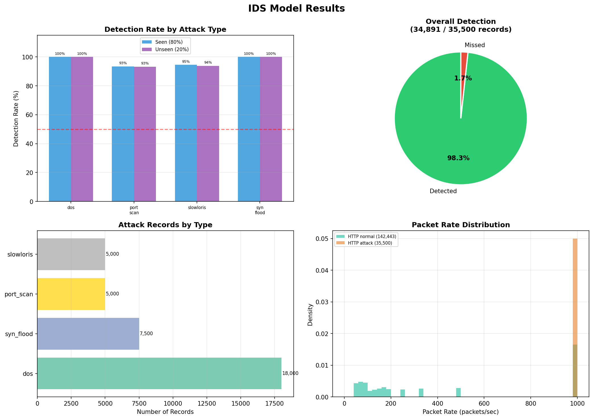
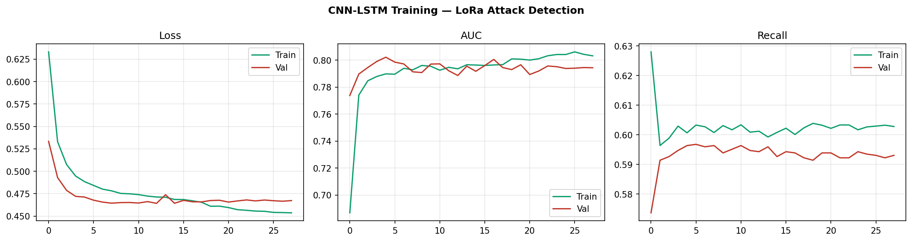
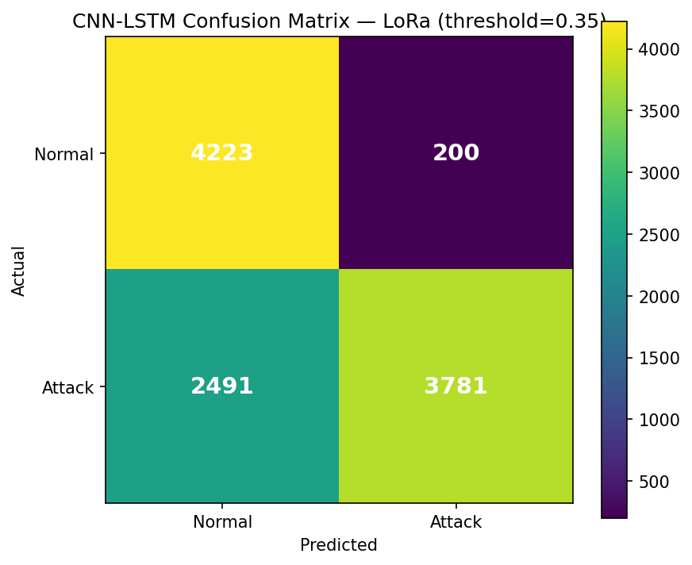
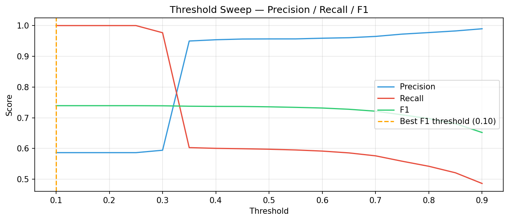
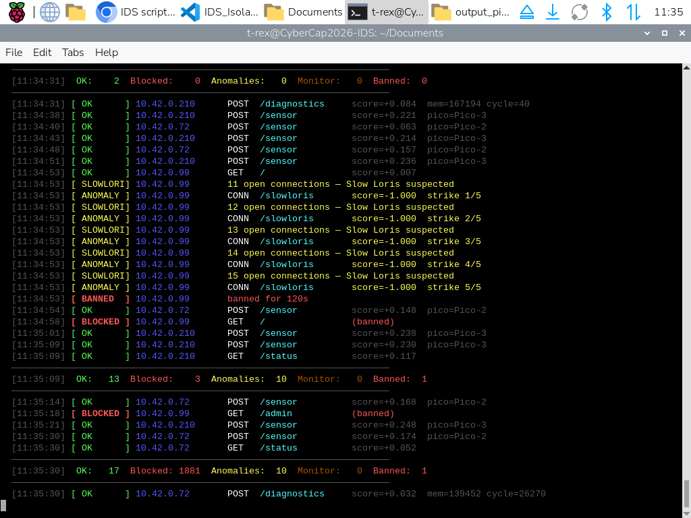
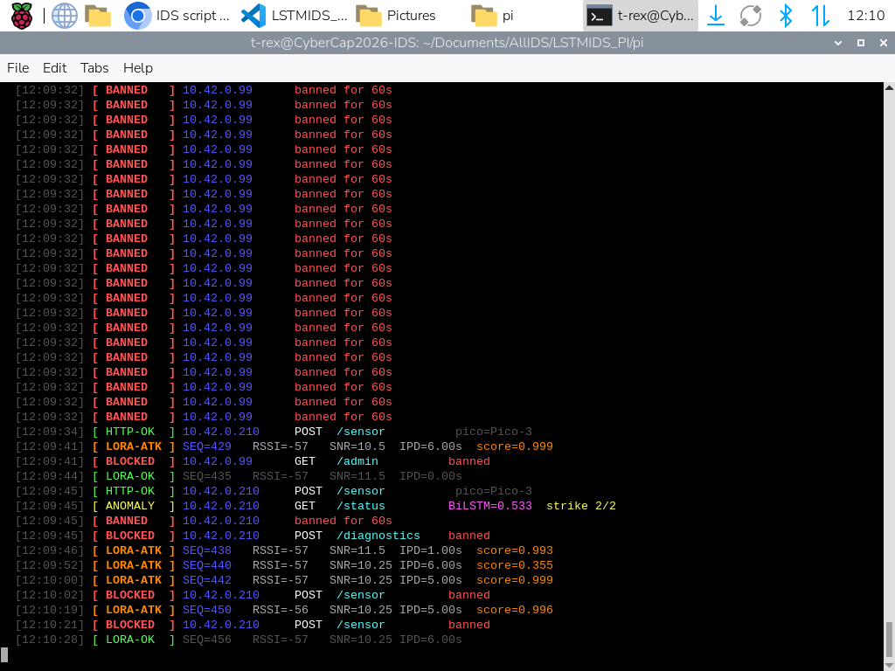

# Intrusion Prevention System for Live IoT Network
*A Hybrid Machine Learning Approach*

**Andrew Banda · James Ivy · Emmanuel Mehn** | Advisor: Joseph Meier

---

A fully functional hybrid IDS/IPS deployed on a **Raspberry Pi 4**, providing real-time autonomous protection for a live IoT sensor network, no cloud dependency, no manual intervention, no enterprise hardware. The system combines three complementary ML models across two physical layers: HTTP and LoRa radio.

> **Key results:** 98.3% HTTP attack detection (34,891 / 35,500 records) · 100% detection on DoS and SYN flood · BiLSTM: 0 false negatives on test set · CNN-LSTM LoRa: 60% attack recall at 4.5% FPR

---

## Network Architecture

```
┌─────────────────────────────────────────────────────┐
│              Raspberry Pi 4  (10.42.0.1)            │
│    ┌──────────────────────────────────────────┐     │
│    │  IDS/IPS Engine                          │     │
│    │  ├── Isolation Forest  (HTTP layer)      │     │
│    │  ├── BiLSTM            (HTTP layer)      │     │
│    │  └── CNN-LSTM          (LoRa layer)      │     │
│    └──────────────────────────────────────────┘     │
│    Wireless AP · HTTP Server · LoRa Receiver        │
└──────────┬───────────────────┬─────────────────────┘
           │ Wi-Fi             │ Wi-Fi
    ┌──────┴──────┐     ┌──────┴──────────┐
    │  Pico W ×3  │     │  Kali Purple    │
    │  Sensor     │     │  (10.42.0.99)   │
    │  Nodes      │     │  Attack Machine │
    └─────────────┘     └─────────────────┘

           LoRa 923 MHz
    ┌──────────────────────┐
    │  Pico W ×2           │
    │  + SX1262 hats       │
    │  Transmitter / RX    │
    └──────────────────────┘
```

| Device | IP | Role |
|---|---|---|
| Raspberry Pi 4 | 10.42.0.1 | IPS engine, HTTP server, LoRa data sink |
| Pico-1 (temperature) | 10.42.0.215 | Sensor node |
| Pico-2 (motion) | 10.42.0.71 | Sensor node |
| Pico-3 (humidity) | 10.42.0.210 | Sensor node |
| Kali Purple | 10.42.0.99 | Attack simulation |
| LoRa Transmitter Pico | — | Simulates normal and malicious radio packets |
| LoRa Receiver Pico | 10.42.0.225 | Forwards radio packets to Pi via HTTP POST |

---

## The Three Models

### 1. Isolation Forest — HTTP Layer (Unsupervised)

Trained exclusively on 140,000+ normal HTTP sensor records, **no labelled attack data required at training time**. Each inbound HTTP request is scored in real time using five derived features. Scores below −0.3 are flagged as anomalous; three strikes triggers a 120-second IP ban with 403 Forbidden responses. Pico sensor IPs are designated as HTTP passthrough, scored and monitored but never banned, ensuring uninterrupted telemetry collection.

**Features:**

| Feature | Description |
|---|---|
| `packet_size` | Distinguishes large-payload attacks from normal sensor POSTs |
| `packet_rate` | Flood attacks generate abnormally high requests/sec |
| `byte_rate` | Catches both high-rate and large-payload anomalies |
| `src_port` | Attackers use ephemeral high ports in rapid succession |
| `endpoint_code` | Probing unknown endpoints (e.g. `/admin`) is a strong attack signal |

**Results (35,500 attack records):**

| Attack Type | Records | Detection Rate |
|---|---|---|
| HTTP DoS Flood | 18,000 | 100% |
| SYN Flood | 7,500 | 100% |
| Slow Loris | ~5,000 | 95% |
| Port Scan | ~3,000 | 93% |
| **Overall** | **35,500** | **98.3%** |



---

### 2. BiLSTM — HTTP Layer (Supervised, Temporal)

A Bidirectional LSTM that processes HTTP request sequences in both forward and backward directions simultaneously, capturing temporal attack patterns that single-request scoring misses, particularly slow-rate attacks like Slow Loris that only become apparent across a sequence of requests. Operates on the same five HTTP features as the Isolation Forest. Achieved **0 false negatives** on the test set, demonstrating strong complementarity with the Isolation Forest by catching graduated temporal attacks that Isolation Forest's per-request scoring underweights.

---

### 3. CNN-LSTM — LoRa Radio Layer

A hybrid CNN-LSTM trained on radio telemetry collected from SX1262-equipped Pico W nodes at 923 MHz. Extends IPS coverage to the physical radio layer, attacks that no HTTP-only IDS would detect. Conv1D layers detect burst patterns in the packet stream; stacked LSTM layers detect slower temporal drift in inter-packet delay and signal characteristics.

**Features:**

| Feature | Description |
|---|---|
| `delta_t` | Timestamp delta between transmit and receive |
| `abs_delta_t` | Collapses positive burst and negative stale attack signals into a single large value |
| `hw_rssi` | Hardware RSSI from SX1262 |
| `hw_snr` | Hardware SNR from SX1262 |
| `ipd` | Inter-packet delay |
| `ipd_ratio` | Current IPD vs. rolling median — burst attacks collapse this near zero |

**Results:** 60% attack recall · 4.5% false positive rate · AUC ~0.80





---

## Attack Scenarios Tested

| Attack | Tool | Description |
|---|---|---|
| HTTP DoS Flood | curl flood script | High-rate HTTP GET flood targeting all endpoints |
| Slow Loris | slowhttptest | Up to 1,000 simultaneous incomplete HTTP connections |
| SYN Flood | hping3, Metasploit `auxiliary/dos/tcp/synflood` | Spoofed TCP SYN packets exhausting the connection table |
| LoRa Replay | Custom Pico transmitter | Legitimate payloads replayed rapidly — detected via abnormal IPD |
| LoRa Join Flood | Custom Pico transmitter | Fake OTAA join requests flooding `/join` |

All attacks were conducted exclusively within an isolated lab network against equipment owned by the project team.

---

## Dataset

| Metric | Value |
|---|---|
| Total training records | 166,750 |
| Normal HTTP records | 140,000+ |
| Attack HTTP records | 35,500 |
| Sensor nodes | 3 Pico W |
| LoRa nodes | 2 Pico W + SX1262 hats |
| Attack machine | Kali Purple |

---

## File Overview

### IDS/IPS Engine

| File | Description |
|---|---|
| `IDS_IsolationForest_PI6.py` | Isolation Forest IPS engine — runs on Raspberry Pi |
| `IDS_model_training.py` | Offline Isolation Forest training pipeline |
| `train_model_windows.py` | Alternate Windows-targeted training script |
| `ids_model.pkl` | Serialized trained Isolation Forest model |

### LoRa Pipeline

| File | Description |
|---|---|
| `lora_server.py` | Flask server on Pi — receives LoRa packets from receiver Pico, splits into normal/attack JSONL |
| `Transmitter_Main.py` | MicroPython LoRa transmitter — normal (10s interval) and attack (0.5s burst) simulation |
| `Reciever_Main.py` | MicroPython LoRa receiver — decodes packets, extracts RSSI/SNR, forwards to Pi |
| `train_lora_lstm.py` | Offline CNN-LSTM training — feature engineering, sequence windowing, threshold sweep |
| `lora_attack_detector.h5` | Serialized trained CNN-LSTM model |
| `lora_scaler.pkl` | RobustScaler fitted on LoRa training data — deploy alongside the model |
| `sx1262.py` / `sx126x.py` / `_sx126x.py` | SX1262 LoRa radio driver for MicroPython |

### Sensor Nodes

| File | Description |
|---|---|
| `Pico_1.py` | Temperature/humidity sensor node firmware |
| `Pico_2.py` | Motion/light sensor node firmware |
| `Pico_3.py` | Humidity/soil moisture sensor node firmware |
| `serversniff.py` | Passive HTTP collection server (used during initial data collection phase) |

### Data

| File | Description |
|---|---|
| `sensor_data.json` | Normal HTTP sensor traffic — Isolation Forest training data |
| `attack_data.json` | General HTTP attack records |
| `DOS_attack_data.json` | DoS flood records |
| `attack_slow_loris.json` | Slow Loris records |
| `attack_port_scan.json` | Port scan records |
| `timesync_attack_data.json` | NTP/time-sync attack records |
| `lora_attack_data.jsonl` | LoRa attack packets — CNN-LSTM training |
| `lora_normal_data.json` | LoRa normal packets — CNN-LSTM training |
| `ids_alerts.log` | Live IPS alert log from deployment |

---

## Setup & Deployment

### Prerequisites

**Raspberry Pi:**
```bash
pip install scikit-learn numpy flask tensorflow joblib
```

**Windows / Desktop (training only):**
```bash
pip install scikit-learn numpy pandas matplotlib tensorflow joblib
```

---

### Step 1 — Train the Isolation Forest

```bash
python IDS_model_training.py --normal sensor_data.json
# Outputs: ids_model.pkl, ids_results.png
```

---

### Step 2 — Train the CNN-LSTM LoRa model

Copy `lora_normal_data.jsonl` and `lora_attack_data.jsonl` from the Pi first, then:

```bash
python train_lora_lstm.py --normal lora_normal_data.jsonl --attack lora_attack_data.jsonl
# Outputs: lora_attack_detector.h5, lora_scaler.pkl, lora_training.png, lora_confusion.png, lora_threshold.png
```

Check the threshold sweep output, use the best F1 threshold value in your deployment config.

---

### Step 3 — Deploy to Raspberry Pi

Copy to the Pi: `IDS_IsolationForest_PI6.py`, `ids_model.pkl`, `lora_attack_detector.h5`, `lora_scaler.pkl`

```bash
sudo python3 IDS_IsolationForest_PI6.py --model ids_model.pkl --port 80
```

---

### Step 4 — Flash Pico W sensor nodes

Open each file in Thonny or use `mpremote`. Before flashing:
- Replace the WiFi credentials placeholder with your network's SSID and password
- Confirm `PI_IP` matches your Pi's address (`10.42.0.1` by default)

| File | Node |
|---|---|
| `Pico_1.py` | Temperature/humidity |
| `Pico_2.py` | Motion/light |
| `Pico_3.py` | Humidity/soil moisture |

---

### Step 5 — Flash LoRa Pico nodes

Copy `sx1262.py`, `sx126x.py`, and `_sx126x.py` to both LoRa Picos. Flash `Transmitter_Main.py` to the transmitter and `Reciever_Main.py` to the receiver. The receiver also needs valid WiFi credentials to POST data back to the Pi.

---

### Step 6 — (Optional) Collect new LoRa training data

Stop the IDS engine, then run the standalone LoRa collection server:

```bash
sudo python3 lora_server.py --host 10.42.0.1 --port 80
# Writes: lora_normal_data.jsonl, lora_attack_data.jsonl
```

---

## IPS Configuration Reference

### Isolation Forest (`IDS_IsolationForest_PI6.py`)

```python
ANOMALY_SCORE_THRESHOLD = -0.5   # Scores below this are flagged (more negative = more anomalous)
ANOMALY_THRESHOLD       = 5      # Strikes before ban
BAN_DURATION_SECS       = 120    # Ban duration in seconds
SLOWLORIS_CONN_LIMIT    = 10     # Concurrent open connections before Slowloris flag
HEADER_SIZE_BYTES       = 200    # HTTP overhead added to content-length for packet_size feature
```

### CNN-LSTM (`train_lora_lstm.py`)

```python
TIME_STEPS  = 20      # Sliding window size in packets
THRESHOLD   = 0.35    # Classification threshold — set from best F1 in threshold sweep
EPOCHS      = 100
BATCH_SIZE  = 64
```

---

## HTTP Endpoints

| Endpoint | Method | Description |
|---|---|---|
| `/sensor` | POST | Periodic sensor telemetry |
| `/alert` | POST | Threshold-triggered sensor alert |
| `/diagnostics` | POST | Node health (free memory, cycle count) |
| `/join` | POST | Node registration on connect |
| `/lora` | POST | LoRa radio telemetry (RSSI, SNR, IPD) |
| `/status` | GET | Server health — prints live stats to terminal |
| `/ntp` | GET | Time sync for Pico nodes |

---

## Live Terminal Output

The IDS engine prints a color-coded real-time dashboard showing per-request status, anomaly scores, strike counts, and running allow/block/ban totals.


*Normal operation — all sensor requests pass with positive anomaly scores*


*Slow Loris attack — connection flood triggers strike accumulation and IP ban*


*BiLSTM + CNN-LSTM active — LoRa attack packets flagged alongside HTTP anomalies*

---

## Layered Defense Summary

| Layer | Model | Handles |
|---|---|---|
| HTTP — volumetric | Isolation Forest | DoS, SYN flood, port scan — rate and payload anomalies |
| HTTP — temporal | BiLSTM | Slow Loris, graduated attacks that evolve across request sequences |
| LoRa radio | CNN-LSTM | Replay attacks, join floods, inter-packet timing anomalies |

---

## Tech Stack

**Languages:** Python 3, MicroPython

**ML / Data:** scikit-learn · TensorFlow/Keras · numpy · pandas · matplotlib · joblib

**Hardware:** Raspberry Pi 4 · Raspberry Pi Pico W ×5 · Semtech SX1262 LoRa HAT ×2

**Networking:** HTTP stdlib · Flask · LoRa 923 MHz · Wi-Fi hotspot (hostapd)

**Attack tools:** Kali Purple · hping3 · slowhttptest · Metasploit · curl

---

## Security Notes

- **WiFi credentials are hardcoded** in the Pico firmware files and `Reciever_Main.py`. Replace with a placeholder or config file before pushing to a public repository.
- The `ids_alerts.log` file contains real IP addresses from the test network — review before publishing.
- All attack testing was conducted on an isolated lab network. No attacks were launched against production or third-party systems.

---

## Authors

**Andrew Banda** — Isolation Forest model and training pipeline, IPS engine architecture (real-time scoring, strike/ban logic, Slowloris detection, feature extraction), overall system integration

**James Ivy** — BiLSTM model, HTTP temporal sequence detection

**Emmanuel Mehn** — CNN-LSTM LoRa model, SX1262 hardware integration, transmitter/receiver Pico firmware

Advisor: **Joseph Meier**

---

## References

- Panneerslevi, R., and Visumathi J. "Temporal Intrusion Detection for MQTT-Based IoT Networks Using LSTM Sequence Modeling." *IEEE Xplore*, 2026.
- Hamza, Kaddour, and Das Shaibai. "Evaluating the Performance of Machine Learning-Based Classification Models for IoT Intrusion Detection." *IEEE Xplore*, 2024.
- S, Snehaa, et al. "Network Intrusion Detector Based on Isolation Forest Algorithm." *IEEE Xplore*, 2023.
- Schuster, M., & Paliwal, K. K. "Bidirectional Recurrent Neural Networks." *IEEE Transactions on Signal Processing*, 1997.

